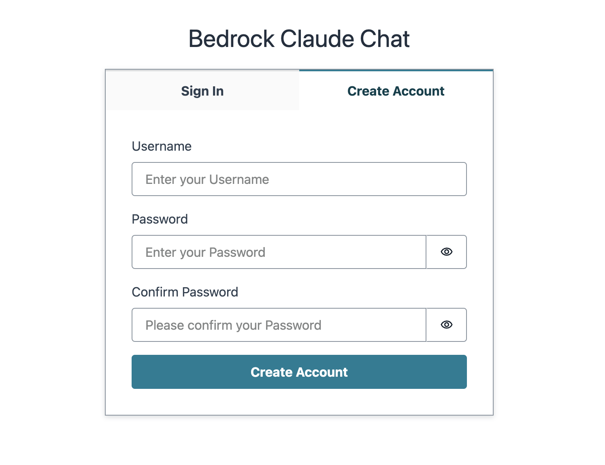
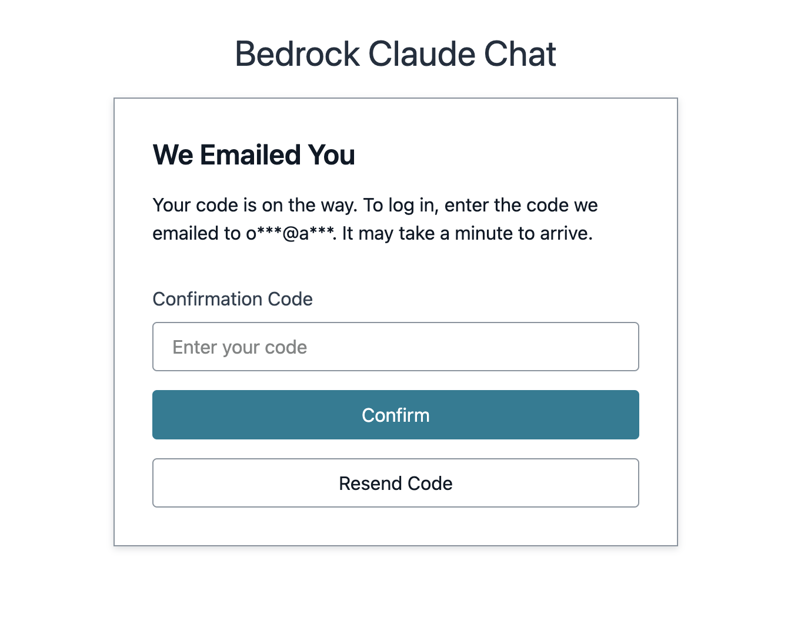
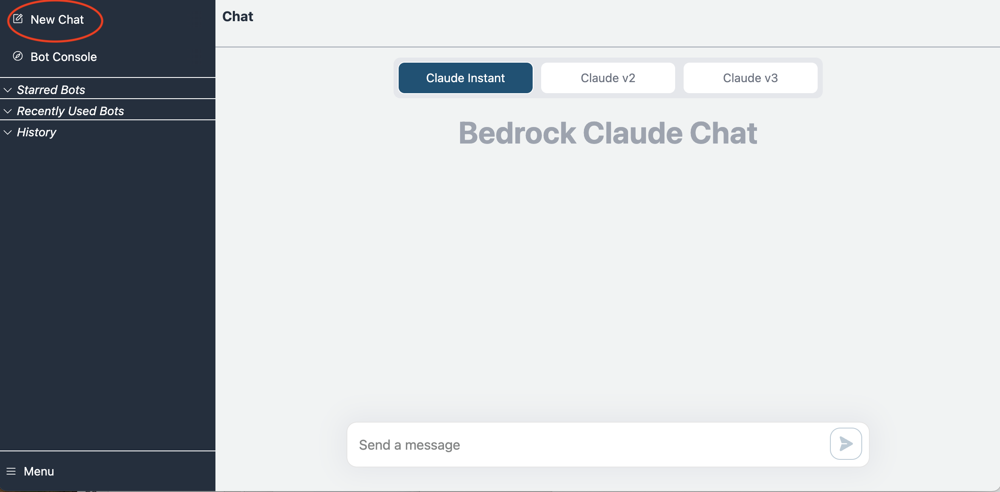
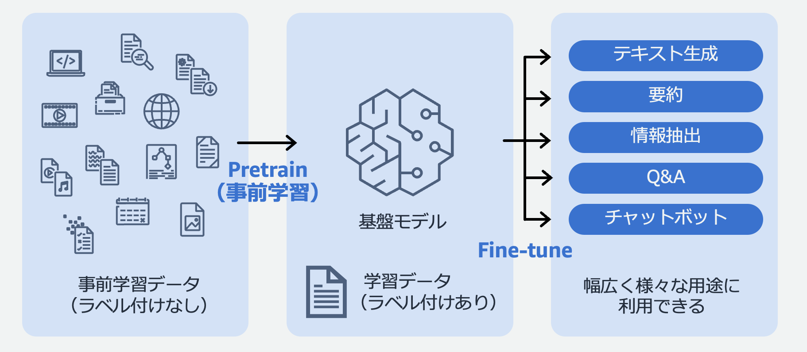
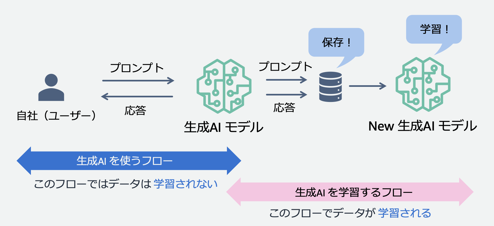
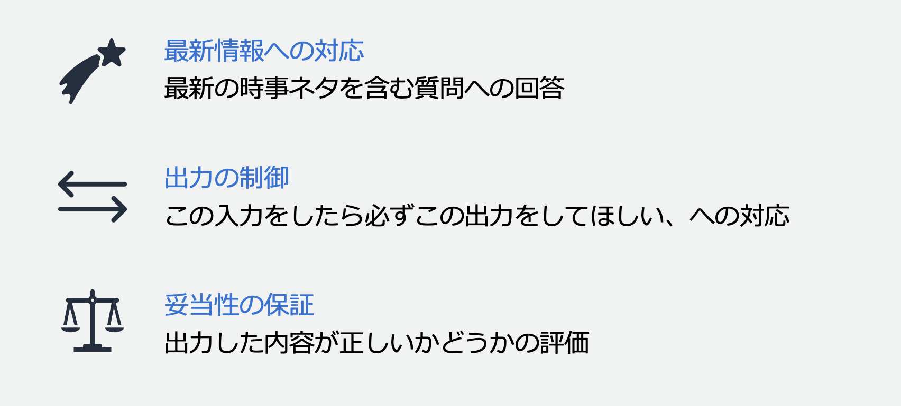
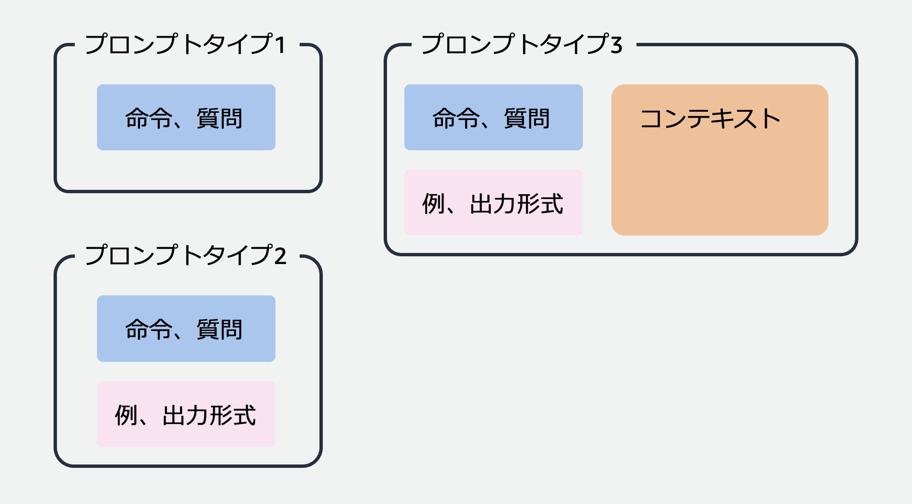

# Anthropic Claude でいろいろな問題を解いてみよう

## 本 Workshop の狙い

ひとりではなかなか踏み出せなかった生成 AI 活用の第一歩を同志と一緒に踏み出すことで、生成 AI で何ができるのか、どんな使い方をすると嬉しいのかをさまざまな観点で理解することができます。Workshop のあとは、さらに自分でアイデアを試したり、最新の生成 AI を試したりすることができるようになっているはずです。

[Anthropic Claude](https://claude.ai/)、[ChatGPT](https://chat.openai.com)、[Bing Copilot](https://www.bing.com/) は個人ですぐに利用できる生成 AI なので、それらを試してみるのも学びが多いと思います。

## アプリのアカウントを作成

割り当てられた URL をブラウザのアドレスバーにペーストしてアプリを開いてください。

すると、以下の画面が表示されるので、Create Account タブをクリックしてアカウントを作成してください。

- Username: ご自身のメールアドレス
- Password: 8 文字以上、大文字、数字、特殊文字（!とか-で OK）を含む



「Create Account」をクリックすると、メールアドレス宛に以下のようなメールが届きます。6 桁の数字をコピーしてください。


以下の画面の「Confirmation Code」のテキストボックスにコードをペーストして「Confirm」ボタンをクリックしてください。数分経っても、ゴミ箱や迷惑メールフォルダにもメールが届かない場合は、メールアドレスが間違っている可能性があるので、再度 Create Account からやり直してください。



## 動作確認

画面左上のメニュの一番上にある「New Chat」をクリックして、テキストボックスに「こんにちは」などと入れてみましょう。Claude が答えてくれたら OK です。



この画面を使って Workshop を進めていきます。課題ごとに New Chat をはじめても良いですし、ずっと同じ画面で続けても OK です。

## LLM の基礎

### 大規模言語モデル（Large Language Model, LLM）とは

大規模言語モデルは、Wikipedia などの大量のテキストデータを使って事前学習することで作られます。事前学習によって、モデルは文法やよくある言い回しなどを覚えることができます。事前学種によって作られたモデルは基盤モデルと呼ばれます。ラベル付きのデータ（例えば、質問と回答の組み合わせのデータ）を使って基盤モデルを Fine-tuning（事後学習）すると、さらにタスクに特化したモデルを作ることができます。



### LLM を使ったらデータがモデルに学習されてしまう？

生成 AI を「使う」だけでデータがモデルに学習されることはありません。以下の図の左半分が生成 AI を「使う」フローですが、ここでは単に生成 AI モデルにプロンプト（入力データ）を入力して、処理結果を取得するだけです。もし、生成 AI モデルの提供企業が入力データを裏側で保存していて、それがモデルの事前学習や Fine-tuning に使われたら、そのとき初めてデータがモデルに学習されることになります。ちなみに、**Amazon Bedrock はお客様のいかなるデータも保存してモデルの学習に使用したり、第三者に提供したりすることはありません。**


### LLM が苦手なこと

上記で説明した通り、モデルが知識を獲得するのはデータを「学習」したときだけなので、学習に使われたデータの中にないことを回答することはできません。無理やり回答させようとすると**ハルシネーション**が発生し、事実と異なる内容が回答されることがあります。少し前の ChatGPT だと「私は xx 年 xx 月以降の内容は答えられません」のように回答することがありましたが、これは学習データにその辺りまでの情報しか含まれていないためです。また、回答の内容を LLM 自身が検証することができないので、最新情報でなくても回答の内容が誤っている可能性があります。そのため、業務で LLM を使う場合は、回答の内容の妥当性の確認を自身で行う必要があります。



## Let's prompt engineering!

LLM の基本をおさえたところで、早速プロンプトを書いていきましょう！

今回の Workshop は **Claude instant** を使って行います。Workshop の環境がデプロイされている AWS アカウントでは Claude 3 はまだ使えませんが、Claude 2 は使えるので、時間があったら Claude instant との違いを比較してみてください。

### プロンプトの種類

プロンプトの種類には、ざっくり以下の 3 種類があります。

- プロンプトタイプ 1：チャット形式で LLM を使うときなどの、LLM に対する命令や質問のみが含まれるケースです。
- プロンプトタイプ 2：みやすくするため、後段の処理で使いやすくするために、命令や質問のほかに回答形式（JSON、マークダウンなど）を指定したり、LLM の回答の精度を上げるために「こう言う場合はこう答えてね」の例を追加するケースです。
- プロンプトタイプ 3：事実に基づいた回答や自社ナレッジに基づいた回答をさせるために、LLM が持っている知識の中からではなく、コンテキストとして与えたデータの中の情報を使って LLM に回答させるケースです。流行っている RAG（Retrieval Augmented Generation）はこれの一種です。



### プロンプトを書く際のコツ

- 簡潔に書く：同じ命令でも文章が短い方が LLM に意図を伝えやすいしコストも安くなります。
- 明確に書く：解釈の余地が生まれるような書き方は適切ではありません。
- 十分な情報を与える：空気読め、察して、常識でわかるでしょ、は厳禁です。タスクの実行に必要な情報は余さず伝えきってください。

### Claude への命令のコツ

- 役割を与える：どんな立場で Claude に回答して欲しいかの役割を与えることで、目的に沿った回答をさせやすくなります。
- XML タグを使う：コンテキスト、例、命令、などテキストの種類に応じて XML タグを使って範囲を指定すると、Claude に意図を理解してもらいやすくなります。

Claude のプロンプトエンジニアリングの詳細は [こちらのドキュメント](https://docs.anthropic.com/claude/docs/prompt-engineering) をご参照ください。

## Lesson 1: プロンプトタイプ 1

まずはベーシックなプロンプトタイプ 1 から始めてみましょう。

### Task 1: 一般的な内容の質問

Claude に、桃太郎がお供にした三匹の動物が何か答えてもらってください。

<details>
<summary>プロンプトの例</summary>
桃太郎がお供にしたのはどんな動物ですか

> [!NOTE]
> 思ってたのと違う動物が回答されたのではないでしょうか？上記プロンプトだと、タヌキが出てくることが多かったです。これはハルシネーションという、LLM が事実と異なる情報を出力する例です。

</details>

### Task 2: ややマニアックな内容の質問

Amazon の OLP の一つを答えてもらってください。

<details>
<summary>プロンプトの例</summary>
NG 例：AmazonのOLPを一つ教えて
OK 例：AmazonのOLP(our Leadership Principles)を一つ教えて

> [!TIP]
> NG 例のプロンプトだと OLP が理解できないようで、出鱈目を答えたり、Amazon の内部情報については教えられないと回答されたりします。OLP が何かを補足することで正しく回答できるようになります。

</details>

> [!NOTE]
> 時間が余ったら、OLP 名を言わず所望の OLP を答えさせられるかチャレンジしてみましょう。

### Task 3: メールの添削

以下のテキストをお客様に送付するビジネスメールとして相応しい文面に直してもらいましょう。

```text
田中さん

昨日はイベントに来てくれてありがとう！楽しんでもらえた？
セッションで使われた資料が欲しいと言ってた気がするので、送りますー。

ではまた！

山田
```

<details>
<summary>プロンプトの例</summary>

```text
以下のテキストをビジネスメールとして相応しい文面に直してください。

田中さん

昨日はイベントに来てくれてありがとう！楽しんでもらえた？
セッションで使われた資料が欲しいと言ってた気がするので、送りますー。

ではまた！

山田
```

> [!TIP]
> 意外とシンプルに命令するだけで期待する結果が得られました。

</details>

> [!NOTE]
> 時間が余ったら、条件を加えたりビジネス以外の用途にして試してみましょう。

### Discussion

テキスト添削のタスクが有効そうなユースケースにはどのようなものが考えられますか？

自分の業務や、お客様のビジネスユースケースであてはまりそうなものを Slack で教えてください。

### Task 4: 英日翻訳

次の英文を日本語にしてもらいましょう。

```text
We started in a garage, but we’re not there anymore. We are big, we impact the world, and we are far from perfect. We must be humble and thoughtful about even the secondary effects of our actions. Our local communities, planet, and future generations need us to be better every day. We must begin each day with a determination to make better, do better, and be better for our customers, our employees, our partners, and the world at large. And we must end every day knowing we can do even more tomorrow. Leaders create more than they consume and always leave things better than how they found them.
```

<details>
<summary>プロンプトの例</summary>

```text
以下の英語のテキストを日本語に翻訳してください。

We started in a garage, but we’re not there anymore. We are big, we impact the world, and we are far from perfect. We must be humble and thoughtful about even the secondary effects of our actions. Our local communities, planet, and future generations need us to be better every day. We must begin each day with a determination to make better, do better, and be better for our customers, our employees, our partners, and the world at large. And we must end every day knowing we can do even more tomorrow. Leaders create more than they consume and always leave things better than how they found them.
```

</details>

> [!NOTE]
> 日本語以外がわかる方は別の言語への翻訳も試してみてください。最近訳すのが難しかったテキストがあればそれも試してみてください。

### Task 5: 感情分析

次のテキストの内容が positive か negative かを判定してもらいましょう。

```text
この商品はとても使いにくいです。持ち上げようとしたら肩が外れてしまいました。
```

<details>
<summary>プロンプトの例</summary>

```text
以下のテキストの内容がpositiveかnegativeか判定してください。
この商品はとても使いにくいです。持ち上げようとしたら肩が外れてしまいました。
```

> [!TIP]
> 意外とシンプルに命令するだけで期待する結果が得られました。

</details>

> [!NOTE]
> 時間が余ったら、他の文面に対して正しい判定ができるか試してみましょう。

## Lesson 2: プロンプトタイプ 2

### Task 6: テキスト分類

次の 3 つのテキストの内容をそれぞれ positive/negative/dosukoi のいずれかに分類してもらいましょう。
なお、dosukoi はお相撲さんに関する内容が分類されるべきラベルです。なので正解は netagive, dosukoi, positive です。

このケースの場合、dosukoi というラベルは一般的ではないので、Task 5 のようなシンプルなプロンプトではうまくいかないはずです。

```text
この商品はとても使いにくいです。持ち上げようとしたら肩が外れてしまいました。
この力士はとても強くて頼もしいです
この本はとても面白いです。友達にも薦めたいです
```

<details>
<summary>ヒント</summary>
どんなテキストに対してどんなラベルをつけるべきかの例を与えることが有効です。また、Claude は XML タグを理解してくれるので、例が書かれた部分を明示的に示すために、例えば &lt;example&gt;&lt;/example&gt; タグで例の部分を囲んで、「&lt;example&gt;タグの中に例を書いたよ」と Claude に教えてあげるのがおすすめです。
</details>

<details>
<summary>プロンプトの例</summary>

```text
以下の3つのテキストの内容をpositive、negative、dosukoiのいずれかに分類してください。
分類例は以下の通りです。
<example>
この商品はとても良い: positive
この商品はちょっと重たい: negative
国技館で見る相撲は素晴らしい: dosukoi
このお相撲さんはかなり大きいです: dosukoi
私は相撲が大好きです: dosukoi
</example>

この商品はとても使いにくいです。持ち上げようとしたら肩が外れてしまいました。
この力士はとても強くて頼もしいです
この本はとても面白いです。友達にも薦めたいです
```

> [!TIP]
> 例を与えることでうまく分類してくれるようになります。dosukoi の例が 2 つだとたまに真ん中のテキストが positive と判定されることがありました。

</details>

> [!NOTE]
> 時間が余ったら、他の文面に対して正しい判定ができるか試してみましょう。

### Discussion

テキスト分類のタスクが有効そうなユースケースにはどのようなものが考えられますか？

自分の業務や、お客様のビジネスユースケースであてはまりそうなものを Slack で教えてください。

### Task 7: 出力形式を指定したテキスト分類

タスク 5 では出力形式を指定していないので、回答がちょっと見にくい感じになっていたはずです。今度は、見やすいように出力形式をマークダウンにするよう指定してみましょう。

<details>
<summary>ヒント</summary>
マークダウンで出力形式を指定する部分は、以下のように書いてみてください。

```text
<format>
## 判定結果
- テキスト
  分類
- テキスト
  分類
</format>
```

</details>

<details>
<summary>プロンプトの例</summary>

```text
以下の3つのテキストの内容をpositive、negative、dosukoiのいずれかに分類してください。
分類例は以下の通りです。
<example>
この商品はとても良い: positive
この商品はちょっと重たい: negative
国技館で見る相撲は素晴らしい: dosukoi
このお相撲さんはかなり大きいです: dosukoi
私は相撲が大好きです: dosukoi
</example>
回答は以下の形式で行なってください。
<format>
## 判定結果
- テキスト
  分類
- テキスト
  分類
</format>

この商品はとても使いにくいです。持ち上げようとしたら肩が外れてしまいました。
この力士はとても強くて頼もしいです
この本はとても面白いです。友達にも薦めたいです
```

> [!TIP]
> 出力形式を指定する際に、「テキスト、分類」のセットが 1 つだけだとうまくマークダウン形式にならなかったので、2 回繰り返してみたらうまくいきました。

</details>

> [!NOTE]
> 時間が余ったら、他の出力形式の書き方を試してみましょう。

## Lesson 3: プロンプトタイプ 3

### Task 8: コンテキストの情報に関する質問

以下のコンテキストを Claude に与えて、契約書が必要な理由がなんなのかを回答させてみましょう。なお、以下の文章は [MoneyForward のサイト](https://biz.moneyforward.com/contract/basic/1721/) から拝借しました。

```markdown
# 契約書が必要な理由

## トラブルを防止するため

契約書は、必ず作成しなければならないものではありません。業務委託などが行われていても、契約書を作成して契約を交わしていないケースもあります。その場合は作成の手間が省けますし、コストも削減できるでしょう。しかし何らかの問題が発生したとき、契約書がないと大きなトラブルに発展するリスクが高くなります。
例えば、報酬の設定について一方が「○○ 円と約束したはずだ」といい、他方が「いや、△△ 円の約束だった」と主張するなど、双方の意見が食い違うことがあります。
契約書に報酬の設定が明記されていれば、このようなトラブルを未然に防ぐことができます。

## スムーズに取引するため

細かいルールや約束事が多い場合でも、契約書に記載しておけば忘れることがありませんし、あらゆる抜け・漏れもなくなります。相手方に何度も確認を取る必要がなくなり、契約書に基づいて契約内容を遂行するだけで済みます。
また、よくある契約内容に関して自社で雛形を作っておけば、その後締結する契約もスムーズに進められます。

## コンプライアンスへの意識を高められるため

契約書を厳格に作成していると、各条項の精査にあたって社内のコンプライアンス意識が高まります。コンプライアンス意識の高まりは契約だけでなく、その他の業務にも良い影響をもたらします。
特に近年は「コンプライアンスを重視するクリーンな企業であること」のアピールが重要であり、コンプライアンス意識が低いと消費者や取引先からの信用が失墜するため、十分注意しなければなりません。
```

<details>
<summary>プロンプトの例</summary>

```text
契約書が必要な理由は何ですか。<context>の中に記載されたテキストから当てはまるものを全て回答してください。

以下の<format>で指定されたフォーマットに従って回答してください。フォーマットで指定されていないことは絶対に言わないでください。

<format>
## 回答
n. 理由
理由が複数ある場合はnの数字を1からインクリメントして続けて記載
</format>

<context>
# 契約書が必要な理由

## トラブルを防止するため

契約書は、必ず作成しなければならないものではありません。業務委託などが行われていても、契約書を作成して契約を交わしていないケースもあります。その場合は作成の手間が省けますし、コストも削減できるでしょう。しかし何らかの問題が発生したとき、契約書がないと大きなトラブルに発展するリスクが高くなります。
例えば、報酬の設定について一方が「○○ 円と約束したはずだ」といい、他方が「いや、△△ 円の約束だった」と主張するなど、双方の意見が食い違うことがあります。
契約書に報酬の設定が明記されていれば、このようなトラブルを未然に防ぐことができます。

## スムーズに取引するため

細かいルールや約束事が多い場合でも、契約書に記載しておけば忘れることがありませんし、あらゆる抜け・漏れもなくなります。相手方に何度も確認を取る必要がなくなり、契約書に基づいて契約内容を遂行するだけで済みます。
また、よくある契約内容に関して自社で雛形を作っておけば、その後締結する契約もスムーズに進められます。

## コンプライアンスへの意識を高められるため

契約書を厳格に作成していると、各条項の精査にあたって社内のコンプライアンス意識が高まります。コンプライアンス意識の高まりは契約だけでなく、その他の業務にも良い影響をもたらします。
特に近年は「コンプライアンスを重視するクリーンな企業であること」のアピールが重要であり、コンプライアンス意識が低いと消費者や取引先からの信用が失墜するため、十分注意しなければなりません。
</context>

```

> [!TIP]
> 出力形式を指定する際に、「1. 理由」のように書くと、3 つの理由のうち一部しか回答してくれないことがあったため n という変数を使ってみました。

</details>

> [!NOTE]
> 時間が余ったら、他の出力形式の書き方を試してみましょう。

### Discussion

コンテキストの情報に関する質問回答タスクが有効そうなユースケースにはどのようなものが考えられますか？何かのドキュメントに対して質問に答えてほしいケースはあるでしょうか？

自分の業務や、お客様のビジネスユースケースであてはまりそうなものを Slack で教えてください。

### Task 9: 気になるワードを抽出

以下のテキストから、人名と場所の情報を抽出してみてください。

```text
私はその人を常に先生と呼んでいた。だからここでもただ先生と書くだけで本名は打ち明けない。これは世間を憚かる遠慮というよりも、その方が私にとって自然だからである。私はその人の記憶を呼び起すごとに、すぐ「先生」といいたくなる。筆を執っても心持は同じ事である。よそよそしい頭文字などはとても使う気にならない。
　私が先生と知り合いになったのは鎌倉である。その時私はまだ若々しい書生であった。暑中休暇を利用して海水浴に行った友達からぜひ来いという端書を受け取ったので、私は多少の金を工面して、出掛ける事にした。私は金の工面に二、三日を費やした。ところが私が鎌倉に着いて三日と経たないうちに、私を呼び寄せた友達は、急に国元から帰れという電報を受け取った。電報には母が病気だからと断ってあったけれども友達はそれを信じなかった。友達はかねてから国元にいる親たちに勧まない結婚を強いられていた。彼は現代の習慣からいうと結婚するにはあまり年が若過ぎた。それに肝心の当人が気に入らなかった。それで夏休みに当然帰るべきところを、わざと避けて東京の近くで遊んでいたのである。彼は電報を私に見せてどうしようと相談をした。私にはどうしていいか分らなかった。けれども実際彼の母が病気であるとすれば彼は固より帰るべきはずであった。それで彼はとうとう帰る事になった。せっかく来た私は一人取り残された。
　学校の授業が始まるにはまだ大分日数があるので鎌倉におってもよし、帰ってもよいという境遇にいた私は、当分元の宿に留まる覚悟をした。友達は中国のある資産家の息子で金に不自由のない男であったけれども、学校が学校なのと年が年なので、生活の程度は私とそう変りもしなかった。したがって一人ぼっちになった私は別に恰好な宿を探す面倒ももたなかったのである。
　宿は鎌倉でも辺鄙な方角にあった。玉突きだのアイスクリームだのというハイカラなものには長い畷を一つ越さなければ手が届かなかった。車で行っても二十銭は取られた。けれども個人の別荘はそこここにいくつでも建てられていた。それに海へはごく近いので海水浴をやるには至極便利な地位を占めていた。
　私は毎日海へはいりに出掛けた。古い燻ぶり返った藁葺の間を通り抜けて磯へ下りると、この辺にこれほどの都会人種が住んでいるかと思うほど、避暑に来た男や女で砂の上が動いていた。ある時は海の中が銭湯のように黒い頭でごちゃごちゃしている事もあった。その中に知った人を一人ももたない私も、こういう賑やかな景色の中に裹まれて、砂の上に寝そべってみたり、膝頭を波に打たしてそこいらを跳ね廻るのは愉快であった。
　私は実に先生をこの雑沓の間に見付け出したのである。その時海岸には掛茶屋が二軒あった。私はふとした機会からその一軒の方に行き慣れていた。長谷辺に大きな別荘を構えている人と違って、各自に専有の着換場を拵えていないここいらの避暑客には、ぜひともこうした共同着換所といった風なものが必要なのであった。彼らはここで茶を飲み、ここで休息する外に、ここで海水着を洗濯させたり、ここで鹹はゆい身体を清めたり、ここへ帽子や傘を預けたりするのである。海水着を持たない私にも持物を盗まれる恐れはあったので、私は海へはいるたびにその茶屋へ一切を脱ぎ棄てる事にしていた。
```

<details>
<summary>プロンプトの例</summary>

```text
以下のテキストから、人名、場所、体の部位の3つの分類に対応する箇所を全て抽出して、該当する分類と合わせて出力してください。抽出した結果は以下のフォーマットで出力してください。

<format>
## 回答
[抽出したテキスト]：[人名 or 場所 or 体の部位のいずれか]
[抽出したテキスト]：[人名 or 場所 or 体の部位のいずれか]
</format>

私はその人を常に先生と呼んでいた。だからここでもただ先生と書くだけで本名は打ち明けない。これは世間を憚かる遠慮というよりも、その方が私にとって自然だからである。私はその人の記憶を呼び起すごとに、すぐ「先生」といいたくなる。筆を執っても心持は同じ事である。よそよそしい頭文字などはとても使う気にならない。
　私が先生と知り合いになったのは鎌倉である。その時私はまだ若々しい書生であった。暑中休暇を利用して海水浴に行った友達からぜひ来いという端書を受け取ったので、私は多少の金を工面して、出掛ける事にした。私は金の工面に二、三日を費やした。ところが私が鎌倉に着いて三日と経たないうちに、私を呼び寄せた友達は、急に国元から帰れという電報を受け取った。電報には母が病気だからと断ってあったけれども友達はそれを信じなかった。友達はかねてから国元にいる親たちに勧まない結婚を強いられていた。彼は現代の習慣からいうと結婚するにはあまり年が若過ぎた。それに肝心の当人が気に入らなかった。それで夏休みに当然帰るべきところを、わざと避けて東京の近くで遊んでいたのである。彼は電報を私に見せてどうしようと相談をした。私にはどうしていいか分らなかった。けれども実際彼の母が病気であるとすれば彼は固より帰るべきはずであった。それで彼はとうとう帰る事になった。せっかく来た私は一人取り残された。
　学校の授業が始まるにはまだ大分日数があるので鎌倉におってもよし、帰ってもよいという境遇にいた私は、当分元の宿に留まる覚悟をした。友達は中国のある資産家の息子で金に不自由のない男であったけれども、学校が学校なのと年が年なので、生活の程度は私とそう変りもしなかった。したがって一人ぼっちになった私は別に恰好な宿を探す面倒ももたなかったのである。
　宿は鎌倉でも辺鄙な方角にあった。玉突きだのアイスクリームだのというハイカラなものには長い畷を一つ越さなければ手が届かなかった。車で行っても二十銭は取られた。けれども個人の別荘はそこここにいくつでも建てられていた。それに海へはごく近いので海水浴をやるには至極便利な地位を占めていた。
　私は毎日海へはいりに出掛けた。古い燻ぶり返った藁葺の間を通り抜けて磯へ下りると、この辺にこれほどの都会人種が住んでいるかと思うほど、避暑に来た男や女で砂の上が動いていた。ある時は海の中が銭湯のように黒い頭でごちゃごちゃしている事もあった。その中に知った人を一人ももたない私も、こういう賑やかな景色の中に裹まれて、砂の上に寝そべってみたり、膝頭を波に打たしてそこいらを跳ね廻るのは愉快であった。
　私は実に先生をこの雑沓の間に見付け出したのである。その時海岸には掛茶屋が二軒あった。私はふとした機会からその一軒の方に行き慣れていた。長谷辺に大きな別荘を構えている人と違って、各自に専有の着換場を拵えていないここいらの避暑客には、ぜひともこうした共同着換所といった風なものが必要なのであった。彼らはここで茶を飲み、ここで休息する外に、ここで海水着を洗濯させたり、ここで鹹はゆい身体を清めたり、ここへ帽子や傘を預けたりするのである。海水着を持たない私にも持物を盗まれる恐れはあったので、私は海へはいるたびにその茶屋へ一切を脱ぎ棄てる事にしていた。
```

> [!TIP]
> 出力形式の表現に手こずりました。抽出したテキストなどで置き換えて欲しい部分を [人名 or 場所 or 体の部位のいずれか] のように [ ] で囲むといい感じになりました。

</details>

## Lesson 4: アイデアソン

ここまでの試行錯誤を経て、LLM でできそうなことのイメージがついてきたのではと思います。次は、こういうユースケースでこういうことができるのでは？というアイデアを試してみましょう！

Anthropic が公開している [プロンプトライブラリ](https://docs.anthropic.com/claude/prompt-library) も参考にしながら、10 分間アイデアを膨らませてみてください。

アイデアができたら、実際にできるか試してみて、その結果を Slack で教えてください。
