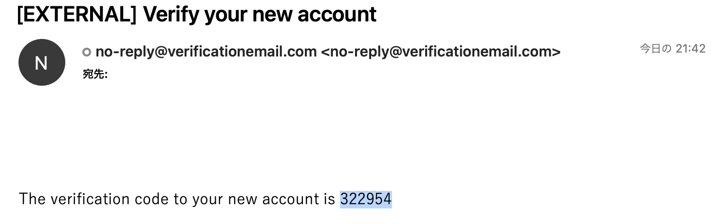
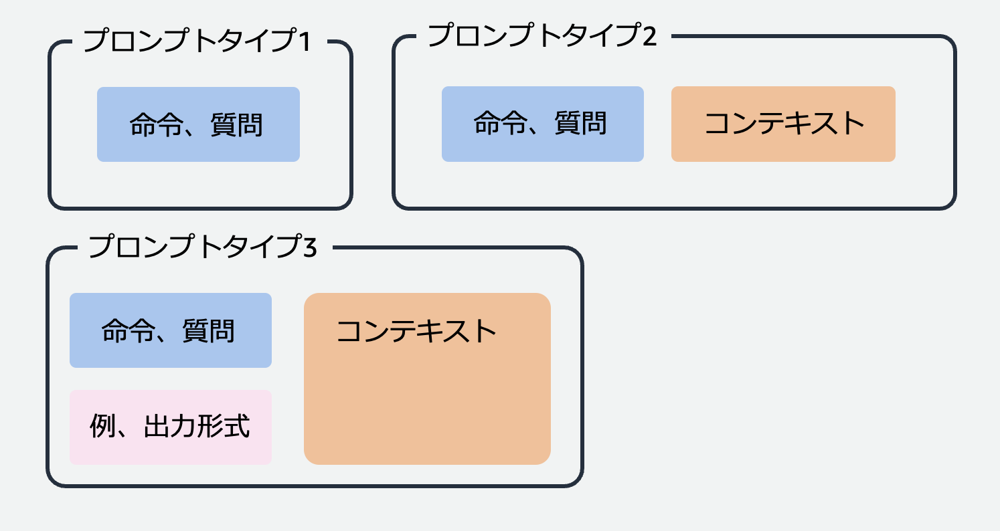

# Anthropic Claude でいろいろな問題を解いてみよう

## アプリのアカウントを作成

割り当てられた URL をブラウザのアドレスバーにペーストしてアプリを開いてください。

すると、以下の画面が表示されるので、Create Account タブをクリックしてアカウントを作成してください。

- Username: ご自身のメールアドレス
- Password: 8 文字以上、大文字、数字、特殊文字（!とか-で OK）を含む


「Create Account」をクリックすると、メールアドレス宛に以下のようなメールが届きます。6 桁の数字をコピーしてください。



以下の画面の「Confirmation Code」のテキストボックスにコードをペーストして「Confirm」ボタンをクリックしてください。数分経っても、ゴミ箱や迷惑メールフォルダにもメールが届かない場合は、メールアドレスが間違っている可能性があるので、再度 Create Account からやり直してください。


## 動作確認

画面左上のメニュの一番上にある「New Chat」をクリックして、テキストボックスに「こんにちは」などと入れてみましょう。Claude が答えてくれたら OK です。


この画面を使って Workshop を進めていきます。課題ごとに New Chat をはじめても良いですし、ずっと同じ画面で続けても OK です。

## LLM の基礎

### 大規模言語モデル（Large Language Model, LLM）とは

大規模言語モデルは、Wikipedia などの大量のテキストデータを使って事前学習することで作られます。事前学習によって、モデルは文法やよくある言い回しなどを覚えることができます。事前学種によって作られたモデルは基盤モデルと呼ばれます。ラベル付きのデータ（例えば、質問と回答の組み合わせのデータ）を使って基盤モデルを Fine-tuning（事後学習）すると、さらにタスクに特化したモデルを作ることができます。


### LLM を使ったらデータがモデルに学習されてしまう？

生成 AI を「使う」だけでデータがモデルに学習されることはありません。以下の図の左半分が生成 AI を「使う」フローですが、ここでは単に生成 AI モデルにプロンプト（入力データ）を入力して、処理結果を取得するだけです。もし、生成 AI モデルの提供企業が入力データを裏側で保存していて、それがモデルの事前学習や Fine-tuning に使われたら、そのとき初めてデータがモデルに学習されることになります。ちなみに、**Amazon Bedrock はお客様のいかなるデータも保存してモデルの学習に使用したり、第三者に提供したりすることはありません。**


### LLM が苦手なこと

上記で説明した通り、モデルが知識を獲得するのはデータを「学習」したときだけなので、学習に使われたデータの中にないことを回答することはできません。無理やり回答させようとすると**ハルシネーション**が発生し、事実と異なる内容が回答されることがあります。少し前の ChatGPT だと「私は xx 年 xx 月以降の内容は答えられません」のように回答することがありましたが、これは学習データにその辺りまでの情報しか含まれていないためです。また、回答の内容を LLM 自身が検証することができないので、最新情報でなくても回答の内容が誤っている可能性があります。そのため、業務で LLM を使う場合は、回答の内容の妥当性の確認を自身で行う必要があります。


## Let's prompt engineering!

LLM の基本をおさえたところで、早速プロンプトを書いていきましょう！

今回の Workshop は **Claude instant** を使って行います。Workshop の環境がデプロイされている AWS アカウントでは Claude 3 はまだ使えませんが、Claude 2 は使えるので、時間があったら Claude instant との違いを比較してみてください。

プロンプトの種類には、ざっくり以下の 3 種類があります。

- プロンプトタイプ 1：チャット形式で LLM を使うときなどの、LLM に対する命令や質問のみが含まれるケースです。
- プロンプトタイプ 2：みやすくするため、後段の処理で使いやすくするために、命令や質問のほかに回答形式（JSON、マークダウンなど）を指定したり、LLM の回答の精度を上げるために「こう言う場合はこう答えてね」の例を追加するケースです。
- プロンプトタイプ 3：事実に基づいた回答や自社ナレッジに基づいた回答をさせるために、LLM が持っている知識の中からではなく、コンテキストとして与えたデータの中の情報を使って LLM に回答させるケースです。流行っている RAG（Retrieval Augmented Generation）はこれの一種です。

  

## Lesson 1: プロンプトタイプ 1

まずはベーシックなプロンプトタイプ 1 から始めてみましょう。

### Task 1: 一般的な内容の質問

Claude に、桃太郎がお供にした三匹の動物が何か答えてもらってください。

<details>
<summary>プロンプトの例</summary>
桃太郎がお供にしたのはどんな動物ですか

> [!NOTE]
> 思ってたのと違う動物が回答されたのではないでしょうか？上記プロンプトだと、タヌキが出てくることが多かったです。

</details>

### Task 2: ややマニアックな内容の質問

Amazon の OLP の一つを答えてもらってください。

<details>
<summary>プロンプトの例</summary>
NG 例：AmazonのOLPを一つ教えて
OK 例：AmazonのOLP(our Leadership Principles)を一つ教えて

> [!NOTE]
> NG 例のプロンプトだと OLP が理解できないようで、出鱈目を答えたり、Amazon の内部情報については教えられないと回答されたりします。OLP が何かを補足することで正しく回答できるようになります。

</details>

> [!NOTE]
> 時間が余ったら、OLP 名を言わず所望の OLP を答えさせられるかチャレンジしてみましょう。

### Task 3: メールの添削

以下のテキストをお客様に送付するビジネスメールとして相応しい文面に直してもらいましょう。

```text
田中さん

昨日はイベントに来てくれてありがとう！楽しんでもらえた？
セッションで使われた資料が欲しいと言ってた気がするので、送りますー。

ではまた！

山田
```

<details>
<summary>プロンプトの例</summary>

```text
以下のテキストをビジネスメールとして相応しい文面に直してください。

田中さん

昨日はイベントに来てくれてありがとう！楽しんでもらえた？
セッションで使われた資料が欲しいと言ってた気がするので、送りますー。

ではまた！

山田
```

> [!NOTE]
> 意外とシンプルに命令するだけで期待する結果が得られました。

</details>

> [!NOTE]
> 時間が余ったら、条件を加えたりビジネス以外の用途にして試してみましょう。

### Task 4: 感情分析

次のテキストの内容が positive か negative かを判定してもらいましょう。

```text
この商品はとても使いにくいです。持ち上げようとしたら肩が外れてしまいました。
```

<details>
<summary>プロンプトの例</summary>

```text
以下のテキストの内容がpositiveかnegativeか判定してください。
この商品はとても使いにくいです。持ち上げようとしたら肩が外れてしまいました。
```

> [!NOTE]
> 意外とシンプルに命令するだけで期待する結果が得られました。

</details>

> [!NOTE]
> 時間が余ったら、他の文面に対して正しい判定ができるか試してみましょう。

## Lesson 2: プロンプトタイプ 2

### Task 5: テキスト分類

次の 3 つのテキストの内容をそれぞれ positive/negative/dosukoi のいずれかに分類してもらいましょう。
なお、dosukoi はお相撲さんに関する内容が分類されるべきラベルです。なので正解は netagive, dosukoi, positive です。

このケースの場合、dosukoi というラベルは一般的ではないので、Task 4 のようなシンプルなプロンプトではうまくいかないはずです。

```text
この商品はとても使いにくいです。持ち上げようとしたら肩が外れてしまいました。
この力士はとても強くて頼もしいです
この本はとても面白いです。友達にも薦めたいです
```

<details>
<summary>ヒント</summary>
どんなテキストに対してどんなラベルをつけるべきかの例を与えることが有効です。また、Claude は XML タグを理解してくれるので、例が書かれた部分を明示的に示すために、例えば &lt;example&gt;&lt;/example&gt; タグで例の部分を囲むのがおすすめです。
</details>

<details>
<summary>プロンプトの例</summary>

```text
以下の3つのテキストの内容をpositive、negative、dosukoiのいずれかに分類してください。
分類例は以下の通りです。
<example>
この商品はとても良い: positive
この商品はちょっと重たい: negative
国技館で見る相撲は素晴らしい: dosukoi
このお相撲さんはかなり大きいです: dosukoi
私は相撲が大好きです: dosukoi
</example>

この商品はとても使いにくいです。持ち上げようとしたら肩が外れてしまいました。
この力士はとても強くて頼もしいです
この本はとても面白いです。友達にも薦めたいです
```

> [!NOTE]
> 例を与えることでうまく分類してくれるようになります。dosukoi の例が 2 つだとたまに positive と判定されることがありました。

</details>

> [!NOTE]
> 時間が余ったら、他の文面に対して正しい判定ができるか試してみましょう。

### Discussion

テキスト分類のタスクが有効そうなユースケースにはどのようなものが考えられますか？
自分の業務や、お客様のビジネスユースケースであてはまりそうなものを Slack で教えてください。
